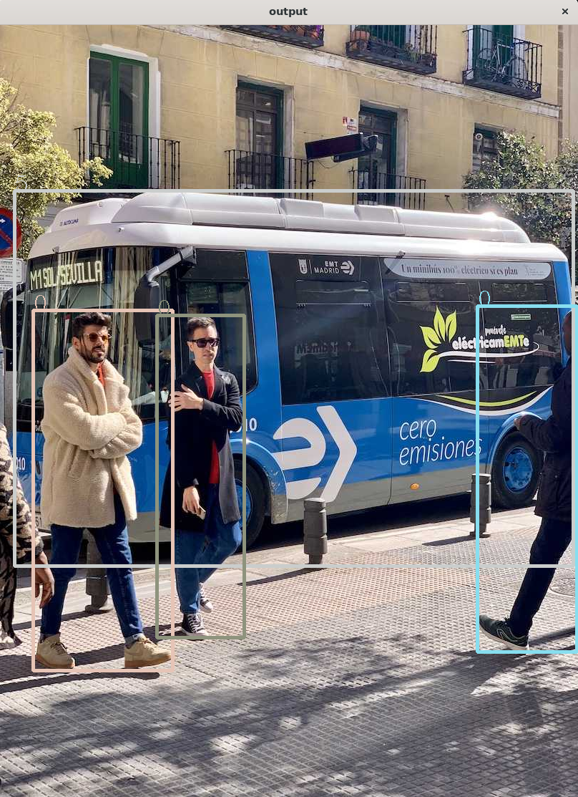
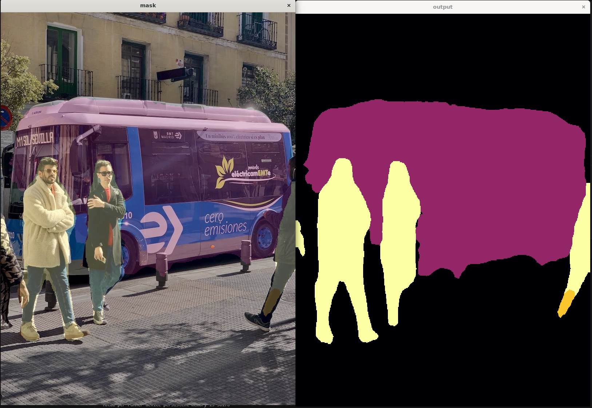

## <div align="center">📄 TensorRT Template</div>

### 🛠️ Introduction
This is a template library for TensorRT inference that supports OpenCV's cv:: Mat type data and can support multiple input and output data.

### ✒️​ Environment
* Windows 11 / Ubuntu20.04
* Visual Studio 2022 ~ 2026 / GNU
* CMake 3.20+
* TensorRT 10.x
* OpenCV > 4.5
* Cuda 11.x / 12.x

### ⚙️ Common Configuration Options

#### CMake Configuration
Before building, you need to configure the library paths in `CMakeLists.txt`:

**For Windows:**
```cmake
set(CUDA_ROOT_DIR "E:/lib/cuda/12.1")              # Path to CUDA installation
set(TensorRT_ROOT_DIR "E:/lib/TensorRT/TensorRT-10.10.0.31")  # Path to TensorRT
set(OpenCV_ROOT_DIR "E:/lib/opencv/opencv-4.8.0/build/x64/vc16/lib")  # Path to OpenCV
set(LIB_TYPE SHARED)  # Options: SHARED (DLL) or STATIC
```

**For Linux:**
```cmake
set(CUDA_ROOT_DIR "/usr/local/cuda")
set(TensorRT_ROOT_DIR "/usr/local/TensorRT-10.10.0.31")
set(LIB_TYPE SHARED)  # Options: SHARED (.so) or STATIC
```

#### Library Type Options
- `LIB_TYPE = SHARED`: Build as shared library (Windows: `.dll`, Linux: `.so`)
- `LIB_TYPE = STATIC`: Build as static library (Windows: `.lib`, Linux: `.a`)

#### Build Configurations
- `--config release`: Optimized release build (recommended for production)
- `--config debug`: Debug build with symbols (for development)

#### Parallel Build
- `-j N`: Use N parallel jobs for faster compilation
- `-j 12`: Use 12 parallel jobs (adjust based on your CPU cores)


### 📦 Build

#### Windows Setup

1. **Install Dependencies:**
   - Download and install [CUDA Toolkit](https://developer.nvidia.com/cuda-downloads) (11.x or 12.x)
   - Download and install [TensorRT](https://developer.nvidia.com/tensorrt) 10.x for Windows
   - Download and build [OpenCV](https://opencv.org/releases/) or use prebuilt binaries

2. **Configure Paths in CMakeLists.txt:**
   ```cmake
   set(CUDA_ROOT_DIR "Your/CUDA/Path")
   set(TensorRT_ROOT_DIR "Your/TensorRT/Path")
   set(OpenCV_ROOT_DIR "Your/OpenCV/Path")
   ```

3. **Build the Project:**
   ```bash
   cmake -S . -B build
   cmake --build build --config release
   ```

4. **Output:**
   - Library: `build/Release/trtemplate.dll` and `build/Release/trtemplate.lib`
   - Executables: `build/Release/yolo.exe`, `build/Release/fcn.exe`, etc.

#### Linux Setup

1. **Install Dependencies:**
   ```bash
   sudo apt update
   sudo apt install cuda-toolkit-12-x  # or cuda-toolkit-11-x
   sudo apt install libopencv-dev
   ```

2. **Install TensorRT:**
   Download TensorRT for Linux from [NVIDIA website](https://developer.nvidia.com/tensorrt) and follow the installation guide.

3. **Configure Paths in CMakeLists.txt:**
   ```cmake
   set(CUDA_ROOT_DIR "/usr/local/cuda")
   set(TensorRT_ROOT_DIR "/path/to/TensorRT")
   ```

4. **Build the Project:**
   ```bash
   cmake -S . -B build
   cmake --build build --config release -j 12
   ```

5. **Output:**
   - Library: `build/libtrtemplate.so`
   - Executables: `build/yolo`, `build/fcn`, etc.

#### Common Build Issues

1. **TensorRT Version Compatibility:**
   - TensorRT 8.x and 10.x APIs are not compatible
   - Must use TensorRT 10.x for this project

2. **CUDA Version Mismatch:**
   - Ensure CUDA version matches TensorRT requirements
   - TensorRT 10.x requires CUDA 11.8 or 12.x

3. **OpenCV Path Issues:**
   - Windows: Point to the `lib` directory containing `*.lib` files
   - Linux: Ensure `pkg-config opencv4 --cflags --libs` works

4. **Build Type:**
   - Use Release builds for production (`--config release`)
   - Use Debug builds for development and debugging


### ✨ Example
First，download the onnx file of YOLOv8 and fcn from the link [GoogleDrive](https://drive.google.com/drive/folders/19UBgYWeEADKTA1w44HIDkzn2oPxKATOH?usp=drive_link).

#### YOLOv8 - Detection Example
convert the onnx file to engien file like
```bash
trtexec \ 
--onnx=./pretrain/yolov8n.onnx \
--saveEngine=./yolov8n.engine
```
build this example by later command
```bash
cmake -S . -B build
cmake --build ./build --config release -j 12
```
run
```bash
./build/Release/yolo.exe
# or linux
./build/yolo 
```
more detail code see YOLO.cc.



#### FCN / Segformer - Segmenatation Example
convert the onnx file to engien file like
```bash
trtexec \ 
--onnx=./pretrain/fcn.onnx \
--saveEngine=./fcn.engine
```
build this example by later command
```bash
cmake -S . -B build
cmake --build ./build --config release -j 12
```
run
```bash
./build/Release/example.exe
# or linux
./build/fcn
```
more detail code see FCN.cc.And Segformer is like this.




#### Template - for your model
If you are writing your own model inference acceleration, Please follow the steps below
* Export the model to ONNX
* Convert ONNX to engine
* Write the preprocess and postprocess code

The following is a preprocess and postprocess code template:

```C++
#include "TRTinfer.h"
#include <opencv2/opencv.hpp>
namespace model{
    // Preprocess for the input blob 
    std::unordered_map<std::string, cv::Mat> preprocess(cv::Mat &left, cv::Mat &right)
    {
        ...
    }
    // Postprocess for the input blob 
    std::unordered_map<std::string, cv::Mat> postprocess(std::unordered_map<std::string, cv::Mat> )
    {
        ...
    }
}
int main(int argc, char *argv[])
{
    cv::Mat  tensor1 = cv::imread("...");
    cv::Mat  tensor2 = cv::imread("...");

    // Preprocess
    auto input_blob = model::preprocess(tensor1, tensor2);
    // Model inference
    TRTInfer model("*.engine");
    // Output
    auto output_blob = model(input_blob);
    cv::Mat dst;
    model::postprocess(output_blob);

    // Visualization
    ...
    return 1;
}
```
Here are a few points that may likely cause errors:
* **Tensor Names**
  * Some weight files have inconsistent input tensor names – handle with care
  * Use `polygraphy` to verify tensor names before implementation
* **Data Types**
  * Internal data type conversions may be involved – proceed with caution
  * Common conversions: float32 ↔ float16 (FP16), int8, uint8
* **Input Data Shape**
  * While preprocessing includes resizing, errors may occur inside the model – pay close attention
  * Ensure NCHW vs NHWC format matches model expectations

#### Verifying Model with Polygraphy

It's best to run a check with Python lib `polygraphy` before execution. For example, here's the command for checking YOLOv8:

```bash
$ polygraphy run yolov8n.onnx --onnxrt
[I] RUNNING | Command: /root/miniconda3/envs/dlpy310/bin/polygraphy run yolov8n.onnx --onnxrt
[I] onnxrt-runner-N0-11/21/25-13:22:08  | Activating and starting inference
[I] Creating ONNX-Runtime Inference Session with providers: ['CPUExecutionProvider']
[I] onnxrt-runner-N0-11/21/25-13:22:08 
    ---- Inference Input(s) ----
    {images [dtype=float32, shape=(1, 3, 640, 480)]}
[I] onnxrt-runner-N0-11/21/25-13:22:08 
    ---- Inference Output(s) ----
    {output0 [dtype=float32, shape=(1, 84, 6300)]}
[I] onnxrt-runner-N0-11/21/25-13:22:08  | Completed 1 iteration(s) in 59.11 ms | Average inference time: 59.11 ms.
[I] PASSED | Runtime: 1.037s | Command: /root/miniconda3/envs/dlpy310/bin/polygraphy run yolov8n.onnx --onnxrt
```

The name, type, and dimensions of the tensor can be clearly seen.

#### Engine Conversion Options

When converting ONNX to TensorRT engine, you can use various optimization options:

**Basic Conversion:**
```bash
trtexec --onnx=model.onnx --saveEngine=model.engine
```

**FP16 Precision (Faster, slightly lower accuracy):**
```bash
trtexec --onnx=model.onnx --saveEngine=model.engine --fp16
```

**INT8 Precision (Fastest, requires calibration):**
```bash
trtexec --onnx=model.onnx --saveEngine=model.engine --int8 --calib=calibration.cache
```

**Batch Size Configuration:**
```bash
trtexec --onnx=model.onnx --saveEngine=model.engine --minShapes=input:1x3x640x640 --optShapes=input:1x3x640x640 --maxShapes=input:1x3x640x640
```

**Workspace Size:**
```bash
trtexec --onnx=model.onnx --saveEngine=model.engine --workspace=4096  # in MB
```

**Verbose Output:**
```bash
trtexec --onnx=model.onnx --saveEngine=model.engine --verbose
```
