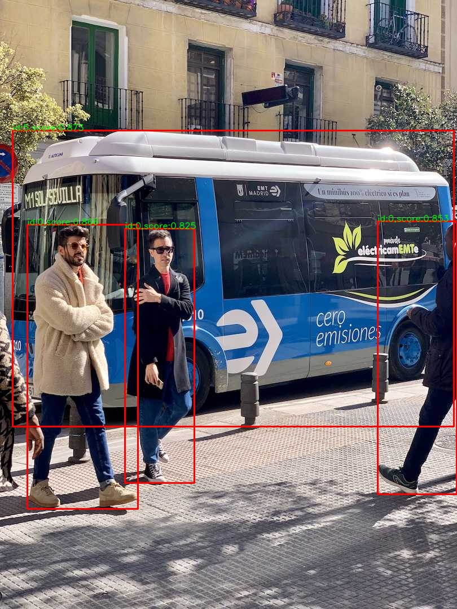

### 1.简介以及环境
这是一个用于TensorRT推理的python打包，对于对于使用者，只需要提供engine文件以及数据的预处理、后处理函数即可，中间推理过程使用model.py进行封装。环境可以参照如下
* Windows 11
* TensorRT 10.0.1.6
* Cuda 11.8
* python 3.8

对于安装了TensorRT的库，在TensorRT库的python目录下有它的.whl文件，选择适配python版本的进行安装，例如作者的python版本是3.8，那么安装命令如下
```bash
pip install tensorrt-10.0.1-cp38-none-win_amd64.whl
```
推理的步骤如下
* 读取数据，进行预处理等操作
* 用tensorrt的engine权重初始化模型
* 模型推理
* 后处理


### 2.YOLOv8 实例
这里提供一个Yolov8示例，首先导出 yolov8 的onnx权重，这个需要参考 https://github.com/ultralytics/ultralytics 的做法，示例命令如下
```bash
yolo export model=yolov8n.pt format=onnx opset=16 imgsz=640,480
```
作者提供了一个onnx模型，现在需要将其转换为engine模型，命令如下
```bash
trtexec --onnx=yolov8n.onnx --saveEngine=yolov8n.engine 
```
如果需要float16类型则添加选项 `--fp16` int8类型则添加 `--int8`，导出后就有一个yolov8n.engine模型，在 `demoYOLO.py` 中将代码
```python
parser.add_argument('-trt', '--trt-file',default= "./yolov8n.engine",type=str)
parser.add_argument('-f', '--im-file', default="./image/bus.jpg",type=str)
```
修改成自己的路径即可，然后运行即可
```bash
python demoYOLO.py
```
结果如下




### 3.更新
添加部分代码，用来支持Tensorrt 8.x 版本。