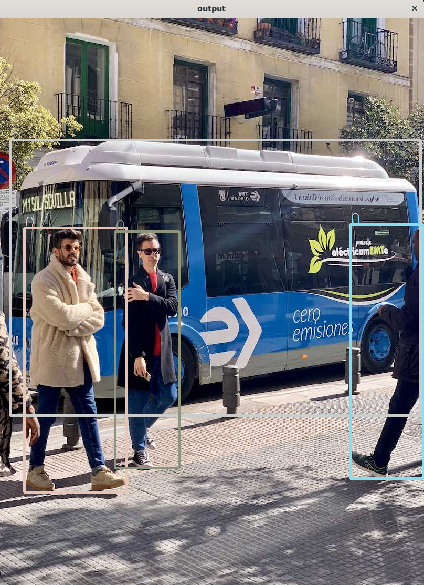
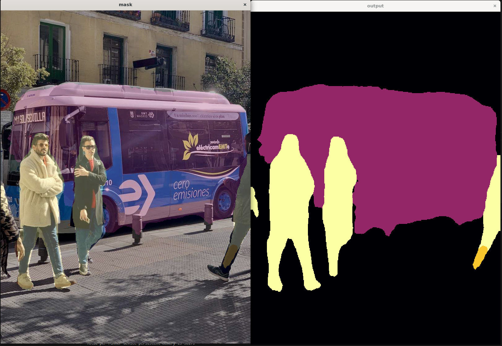

## <div align="center">📄 TensorRT Template</div>

### 🛠️ 简介
这是一个支持 OpenCV cv::Mat 类型数据的 TensorRT 推理模板库，支持多输入多输出数据。

### ✒️ 环境要求
* Windows 11 / Ubuntu 20.04
* Visual Studio 2022 ~ 2026 / GNU
* CMake 3.20+
* TensorRT 10.x
* OpenCV > 4.5
* CUDA 11.x / 12.x

### ⚙️ 常用配置

#### CMake 配置
构建前需要在 `CMakeLists.txt` 中配置库路径：

**Windows:**
```cmake
set(CUDA_ROOT_DIR "E:/lib/cuda/12.1")
set(TensorRT_root_dir "E:/lib/TensorRT/TensorRT-10.10.0.31")
set(OpenCV_root_dir "E:/lib/opencv/opencv-4.8.0/build/x64/vc16/lib")
set(LIB_TYPE SHARED)  # SHARED (.dll) 或 STATIC (.lib)
```

**Linux:**
```cmake
set(CUDA_ROOT_DIR "/usr/local/cuda")
set(TensorRT_root_dir "/usr/local/TensorRT-10.10.0.31")
set(LIB_TYPE SHARED)  # SHARED (.so) 或 STATIC (.a)
```

#### 库类型选项
- `LIB_TYPE = SHARED`: 动态库 (Windows: `.dll`, Linux: `.so`)
- `LIB_TYPE = STATIC`: 静态库 (Windows: `.lib`, Linux: `.a`)


### 📦 构建

#### Windows

1. **安装依赖:**
   - 下载并安装 [CUDA Toolkit](https://developer.nvidia.com/cuda-downloads)
   - 下载并安装 [TensorRT](https://developer.nvidia.com/tensorrt) 10.x
   - 下载并编译 [OpenCV](https://opencv.org/releases/)

2. **配置 CMakeLists.txt:**
   ```cmake
   set(CUDA_ROOT_DIR "Your/CUDA/Path")
   set(TensorRT_root_dir "Your/TensorRT/Path")
   set(OpenCV_root_dir "Your/OpenCV/Path")
   ```

3. **构建:**
   ```bash
   cmake -S . -B build
   cmake --build build --config release
   ```

4. **输出:**
   - 库: `build/Release/trtemplate.dll` 和 `build/Release/trtemplate.lib`
   - 可执行文件: `build/Release/yolo.exe`, `build/Release/fcn.exe`

#### Linux

1. **安装依赖:**
   ```bash
   sudo apt update
   sudo apt install cuda-toolkit-12-x
   sudo apt install libopencv-dev
   ```

2. **安装 TensorRT:**
   从 [NVIDIA 官网](https://developer.nvidia.com/tensorrt) 下载并安装

3. **配置 CMakeLists.txt:**
   ```cmake
   set(CUDA_ROOT_DIR "/usr/local/cuda")
   set(TensorRT_root_dir "/path/to/TensorRT")
   ```

4. **构建:**
   ```bash
   cmake -S . -B build
   cmake --build build --config release -j 12
   ```

5. **输出:**
   - 库: `build/libtrtemplate.so`
   - 可执行文件: `build/yolo`, `build/fcn`

#### 常见构建问题

1. **TensorRT 版本兼容性:**
   - TensorRT 8.x 不兼容
   - 必须使用 TensorRT 10.x

2. **CUDA 版本匹配:**
   - 确保 CUDA 版本与 TensorRT 匹配
   - TensorRT 10.x 需要 CUDA 11.8 或 12.x

3. **OpenCV 路径问题:**
   - Windows: 指向包含 `*.lib` 文件的 `lib` 目录
   - Linux: 确保 `pkg-config opencv4 --cflags --libs` 可用

4. **构建类型:**
   - 生产环境使用 Release (`--config release`)
   - 开发调试使用 Debug


### ✨ 使用示例

首先，从链接 [GoogleDrive](https://drive.google.com/drive/folders/19UBgYWeEADKTA1w44HIDkzn2oPxKATOH?usp=drive_link) 下载 YOLOv8 和 FCN 的 onnx 文件。

#### YOLOv8 - 目标检测示例
将 onnx 文件转换为 engine 文件：
```bash
trtexec \
--onnx=./pretrain/yolov8n.onnx \
--saveEngine=./yolov8n.engine
```

构建示例：
```bash
cmake -S . -B build
cmake --build ./build --config release -j 12
```

运行：
```bash
# Windows
./build/Release/yolo.exe
# Linux
./build/yolo
```

详细代码见 [YOLO.cc](example/YOLO.cc)



#### FCN / Segformer - 语义分割示例
将 onnx 文件转换为 engine 文件：
```bash
trtexec \
--onnx=./pretrain/fcn.onnx \
--saveEngine=./fcn.engine
```

构建和运行方式同上，详细代码见 [FCN.cc](example/FCN.cc)，Segformer 使用方式类似。




### 🔧 API 使用

#### 创建模型实例

```cpp
// 使用工厂方法创建实例（推荐）
auto model = TRTInfer::create("model.engine");

// 手动初始化（可选，用于预热或提前验证）
model->Init();

// 推理调用
std::unordered_map<std::string, cv::Mat> input;
input["images"] = cv::imread("test.jpg");

auto output = (*model)(input);
cv::Mat result = output["output"];
```

#### 查询张量信息

```cpp
// 获取输入/输出张量名称
auto input_names = model->getInputNames();
auto output_names = model->getOutputNames();

// 获取指定张量形状
TensorShape shape = model->getInputShape("images");
std::cout << "Batch: " << shape.n << ", Channel: " << shape.c
          << ", Height: " << shape.h << ", Width: " << shape.w << std::endl;
```

#### 动态批处理

```cpp
// 设置不同的批大小
model->setInputShape("input", {1, 3, 640, 640});   // 单张
auto output1 = (*model)(input1);

model->setInputShape("input", {4, 3, 640, 640});   // 批大小为4
auto output2 = (*model)(input_batch);
```


### 📋 模型模板

如果需要编写自己的模型推理加速，请按以下步骤操作：
1. 导出模型为 ONNX
2. 将 ONNX 转换为 engine
3. 编写预处理和后处理代码

以下是一个预处理和后处理代码模板：

```cpp
#include "TRTinfer.h"
#include <opencv2/opencv.hpp>

namespace model {

// 输入预处理
std::unordered_map<std::string, cv::Mat> preprocess(cv::Mat &left, cv::Mat &right)
{
    // ...
}

// 输出后处理
std::unordered_map<std::string, cv::Mat> postprocess(
    std::unordered_map<std::string, cv::Mat> output)
{
    // ...
}

} // namespace model

int main(int argc, char *argv[])
{
    cv::Mat tensor1 = cv::imread("...");
    cv::Mat tensor2 = cv::imread("...");

    // 预处理
    auto input_blob = model::preprocess(tensor1, tensor2);

    // 模型推理
    auto model = TRTInfer::create("*.engine");
    auto output_blob = (*model)(input_blob);

    // 后处理
    model::postprocess(output_blob);

    // 可视化
    // ...

    return 1;
}
```

### ⚠️ 注意事项

可能导致错误的几个关键点：

* **张量名称**
  * 某些权重文件的输入张量名称不一致
  * 实现前使用 `polygraphy` 验证张量名称

* **数据类型**
  * 内部可能涉及数据类型转换
  * 常见转换: float32 ↔ float16 (FP16), int8, uint8

* **输入数据形状**
  * 预处理包含 resize，但模型内部可能出错
  * 确保 NCHW vs NHWC 格式匹配模型预期


### ✅ 使用 Polygraphy 验证模型

建议执行前使用 Python 库 `polygraphy` 进行检查。例如，检查 YOLOv8：

```bash
$ polygraphy run yolov8n.onnx --onnxrt
[I] RUNNING | Command: /root/miniconda3/envs/dlpy310/bin/polygraphy run yolov8n.onnx --onnxrt
[I] onnxrt-runner-N0-11/21/25-13:22:08 | Activating and starting inference
[I] Creating ONNX-Runtime Inference Session with providers: ['CPUExecutionProvider']
[I] onnxrt-runner-N0-11/21/25-13:22:08
    ---- Inference Input(s) ----
    {images [dtype=float32, shape=(1, 3, 640, 480)]}
[I] onnxrt-runner-N0-11/21/25-13:22:08
    ---- Inference Output(s) ----
    {output0 [dtype=float32, shape=(1, 84, 6300)]}
[I] onnxrt-runner-N0-11/21/25-13:22:08 | Completed 1 iteration(s) in 59.11 ms | Average inference time: 59.11 ms.
[I] PASSED | Runtime: 1.037s | Command: /root/miniconda3/envs/dlpy310/bin/polygraphy run yolov8n.onnx --onnxrt
```

可以清楚看到张量的名称、类型和维度。


### 🔄 Engine 转换选项

将 ONNX 转换为 TensorRT engine 时，可以使用各种优化选项：

**基本转换:**
```bash
trtexec --onnx=model.onnx --saveEngine=model.engine
```

**FP16 精度 (更快，精度略降):**
```bash
trtexec --onnx=model.onnx --saveEngine=model.engine --fp16
```

**INT8 精度 (最快，需要校准):**
```bash
trtexec --onnx=model.onnx --saveEngine=model.engine --int8 --calib=calibration.cache
```

**批大小配置:**
```bash
trtexec --onnx=model.onnx --saveEngine=model.engine --minShapes=input:1x3x640x640 --optShapes=input:1x3x640x640 --maxShapes=input:1x3x640x640
```

**工作空间大小:**
```bash
trtexec --onnx=model.onnx --saveEngine=model.engine --workspace=4096  # MB
```

**详细输出:**
```bash
trtexec --onnx=model.onnx --saveEngine=model.engine --verbose
```


### 📁 项目结构

```
TensorRTTemplate/
├── TRTInfer/                 # 核心推理库
│   ├── TRTinfer.h           # 头文件
│   ├── TRTinfer.cc           # 实现文件
│   ├── utility.h             # 工具函数
│   ├── utility.cc            # 工具实现
│   ├── config.h              # 配置
│   └── benchmark.h            # 性能测试
├── example/                  # 示例代码
│   ├── YOLO.cc              # YOLOv8 目标检测
│   ├── FCN.cc               # FCN 语义分割
│   ├── Segformer.cc         # Segformer 语义分割
│   ├── IGEV.cc              # IGEV 双目匹配
│   ├── LiteAnyStereo.cc     # LiteAnyStereo 双目匹配
│   └── LiteAnyStereoVideo.cc # 视频流双目匹配
├── demo/                     # 示例图片
├── pretrain/                 # 预训练模型
├── CMakeLists.txt           # CMake 配置
└── README.md                # 说明文档
```
