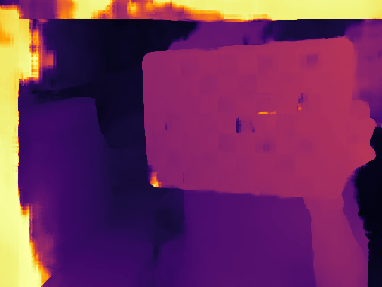

### Introduction
This is a template library for TensorRT inference that supports OpenCV's cv:: Mat type data and can support multiple input and output data.

### Environment
* Windows 11
* msvc
* TensorRT 10.x
* OpenCV > 4.5
* Cuda 11.x


### Build
```bash
cmake -S . -B build
cmake --build build --config release
```


### Example
#### 1. Template
```C++
#include "TRTinfer.h"
#include <opencv2/opencv.hpp>
std::unordered_map<std::string, cv::Mat> preprocess(cv::Mat &left, cv::Mat &right)
{
    ...
}
std::unordered_map<std::string, cv::Mat> postprocess(std::unordered_map<std::string, cv::Mat> )
{
    ...
}
int main(int argc, char *argv[])
{
    cv::Mat  tensor1 = cv::imread("...");
    cv::Mat  tensor2 = cv::imread("...");

    // 预处理
    auto input_blob = preprocess(tensor1, tensor2);
    //  模型
    TRTInfer model("*.engine");
    //  输出
    auto output_blob = model(input_blob);
    cv::Mat dst;
    postprocess(output_blob);
    return 1;
}
```

#### 2.YOLOv8
convert the onnx file to engien file like
```bash
trtexec \ 
--onnx=./pretrain/yolov8n.onnx \
--saveEngine=./pretrain/yolov8n.engine
```
build this example by later command
```bash
cmake -S . -B build
cmake --build ./build --config release -j 12
```
run
```bash
./build/Release/example ./pretrain/yolov8n.engine ./data/bus.jpg
```

the result
|input|output|
|---|---|
|||


#### 3.FastACV
convert the onnx file to engien file like
```bash
trtexec \ 
--onnx=./pretrain/fastacv.onnx \
--saveEngine=./pretrain/fastacv.engine
```
build this example by later command
```bash
cmake -S . -B build
cmake --build ./build --config release -j 12
```
run
```bash
./build/fastacv ./pretrain/fastacv.engine ./data/left.png ./data/right.png 
```

the result

|left|right|disp|
|---|---|---|
||||